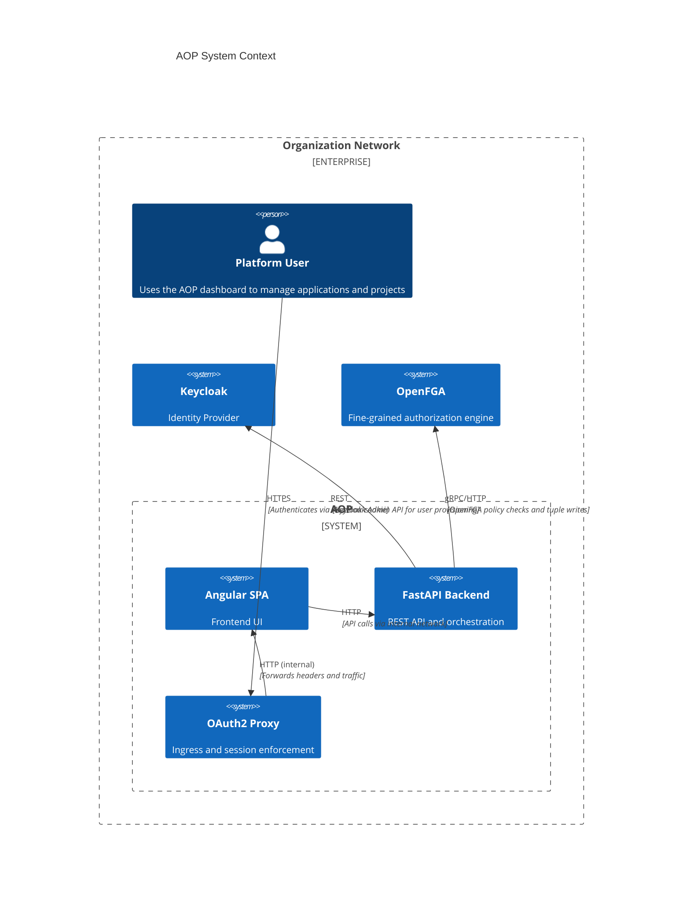
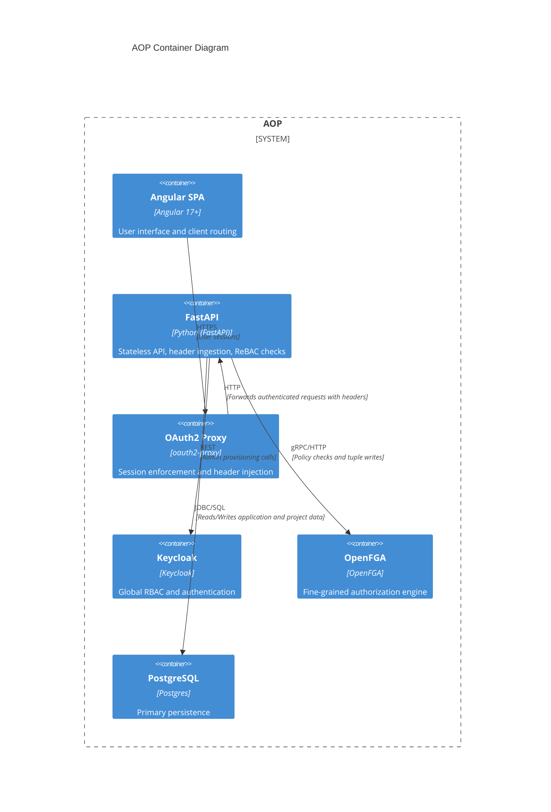

# Application Orchestration Platform Architecture (C4-style)

## System Context



## Container Diagram



## Component Diagram (API)

```mermaid
%%{init: {"securityLevel": "loose"}}%%
C4Component
    title FastAPI Components
    Container(api, "FastAPI", "Python", "Backend") {
      Component(mw, "Auth Header Middleware", "Middleware", "Parses `X-Auth-Request-*` headers and attaches identity to request")
      Component(appsrv, "Application Service", "Service", "CRUD operations and business logic for applications")
      Component(projectsrv, "Project Service", "Service", "Flattened project query and project-level actions")
      Component(authz, "OpenFGA Client", "Client", "Policy checks and tuple writes")
      Component(keyadmin, "Keycloak Admin Client", "Client", "User provisioning and role assignment")
    }
    Rel(api.mw, appsrv, "passes identity")
    Rel(appsrv, authz, "check/write")
    Rel(appsrv, db, "persist")
    Rel(keyadmin, ke, "calls")
```

## Notes
- The diagrams use C4-style notation in Mermaid blocks. If your renderer does not support `C4Context/C4Container/C4Component`, you can render as standard flowcharts or use external C4 tooling.
- Keep OpenFGA model and tuple migrations alongside these diagrams.
