# Application Orchestration Platform Architecture

## 1. Purpose and scope

The Application Orchestration Platform is a multi-tenant, multi-OS control plane for application lifecycle operations. It combines an Angular dashboard, a FastAPI backend, identity and authorization services, and deployment-mode aware workflows for Kubernetes, Docker Compose, and bare-metal/systemd environments.

### Core goals
- Provide a unified dashboard for applications, projects, nodes, telemetry, and creation flows.
- Support multiple personas: platform admin, developer, and auditor.
- Adapt the UI and backend semantics to deployment mode and operating system.
- Enforce role-aware actions and authorization policies for create, scale, redeploy, and audit use cases.

## 2. Overall architecture

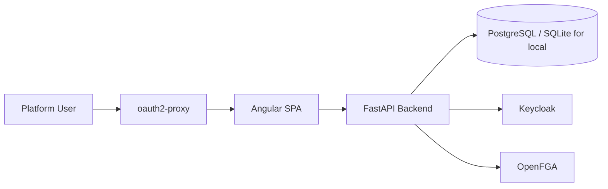

### Runtime responsibilities
- Frontend: dashboard state, persona selection, deployment-mode switching, wizard interactions.
- Backend: request validation, role checks, state retrieval, orchestration payload assembly, app lifecycle commands.
- Auth layer: identity, role propagation, and fine-grained authorization.
- Persistence: application/project metadata plus audit-trace friendly records.

## 3. System context

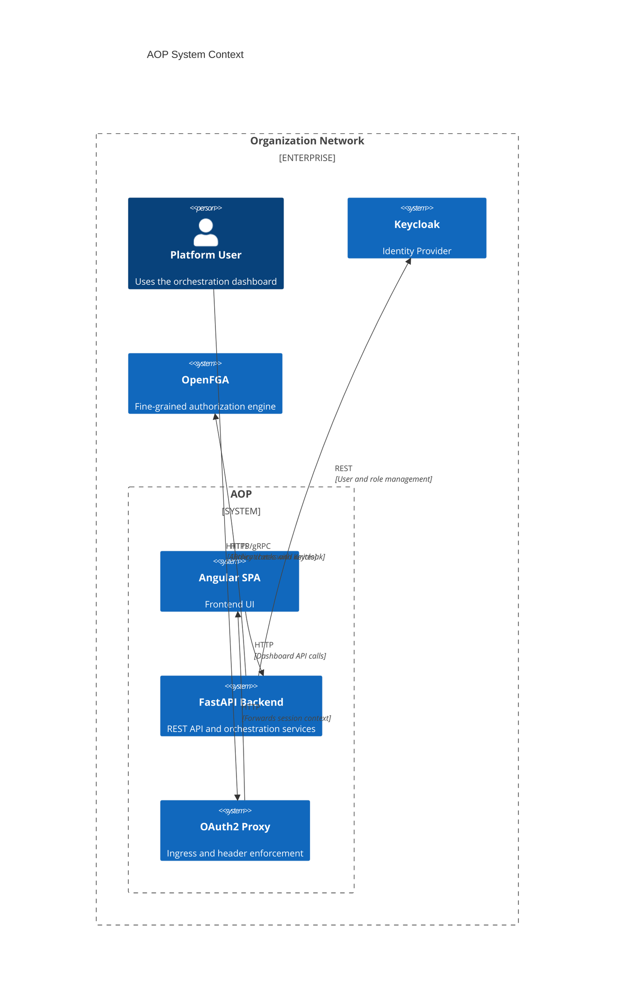

## 4. Container diagram

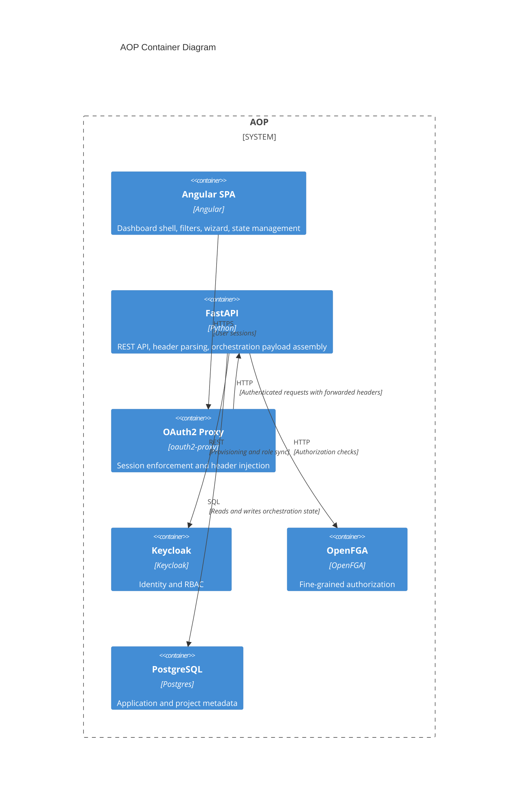

## 5. Backend component view

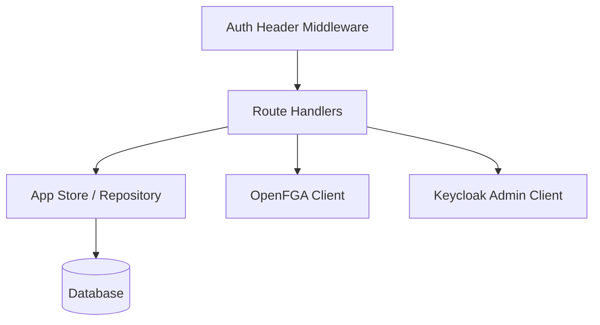

### Component responsibilities
- Auth Header Middleware: injects user and roles from forwarded headers.
- Route Handlers: expose the dashboard APIs for applications, orchestration payloads, and creation flows.
- App Store: serializes and retrieves application data in a deployment-mode agnostic shape.
- Policy client: enforce persona and resource rules.
- Keycloak client: manage provisioning and role mapping when needed.

## 6. Frontend component map

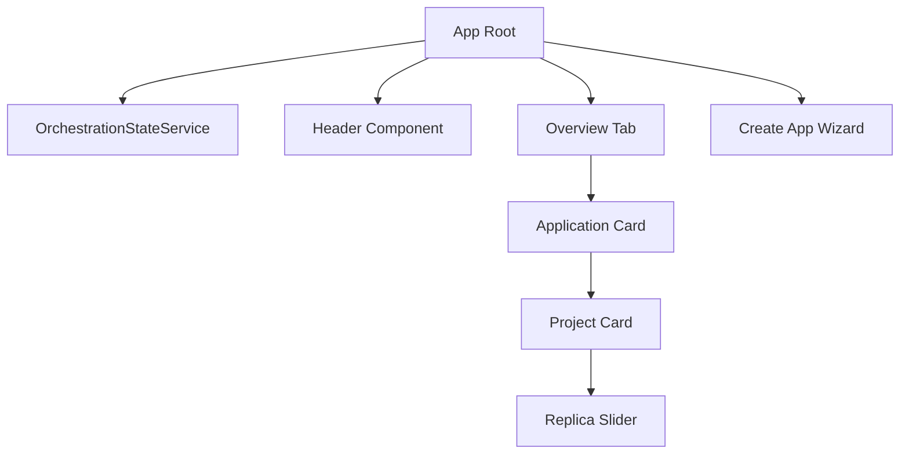

## 7. Observability architecture

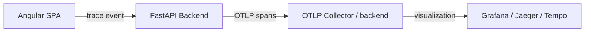

The OpenTelemetry pipeline is intentionally lightweight: the backend auto-instruments FastAPI request handling and emits explicit spans for key app lifecycle operations, while the frontend emits a bootstrap span from the Angular shell. When `OTEL_EXPORTER_OTLP_ENDPOINT` is set, the backend exports spans to an OTLP HTTP receiver.

## 8. Sequence diagrams

### 7.1 Application creation via Git import

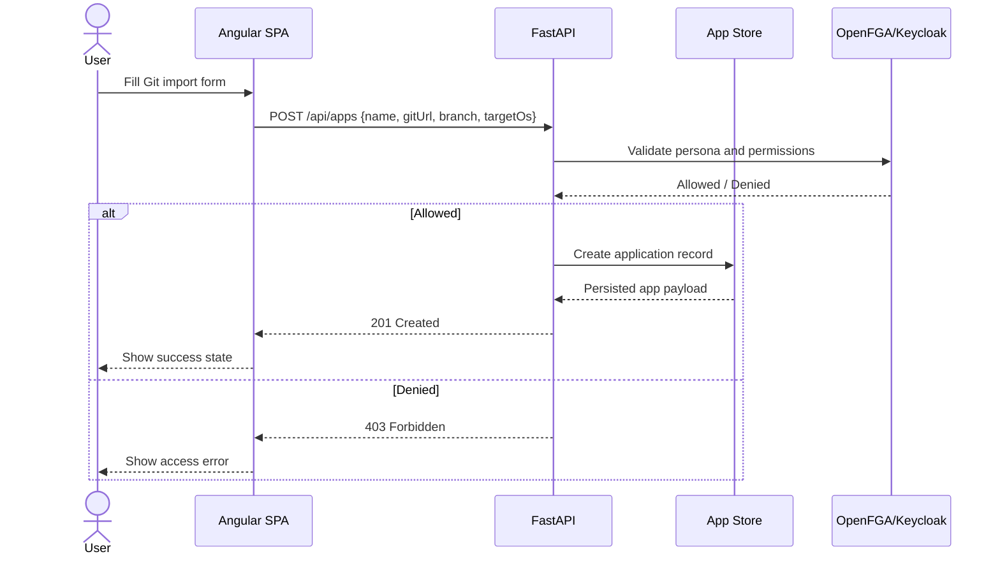

### 7.2 ZIP upload and runtime detection

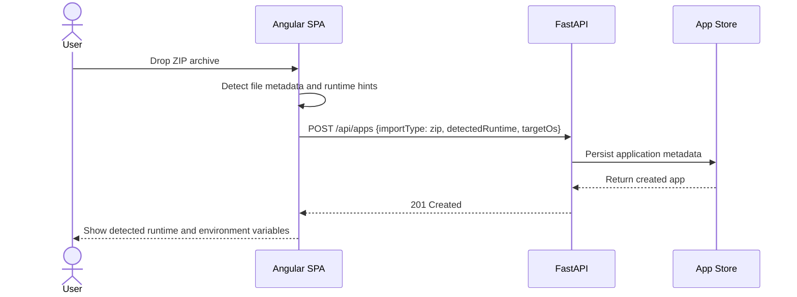

### 7.3 Persona-based access control

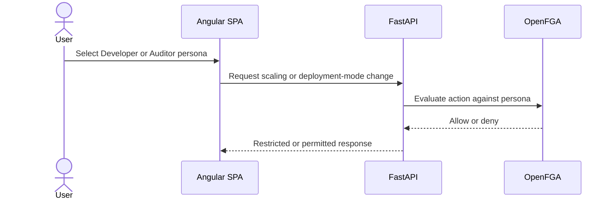

## 8. Class diagram for the core domain model

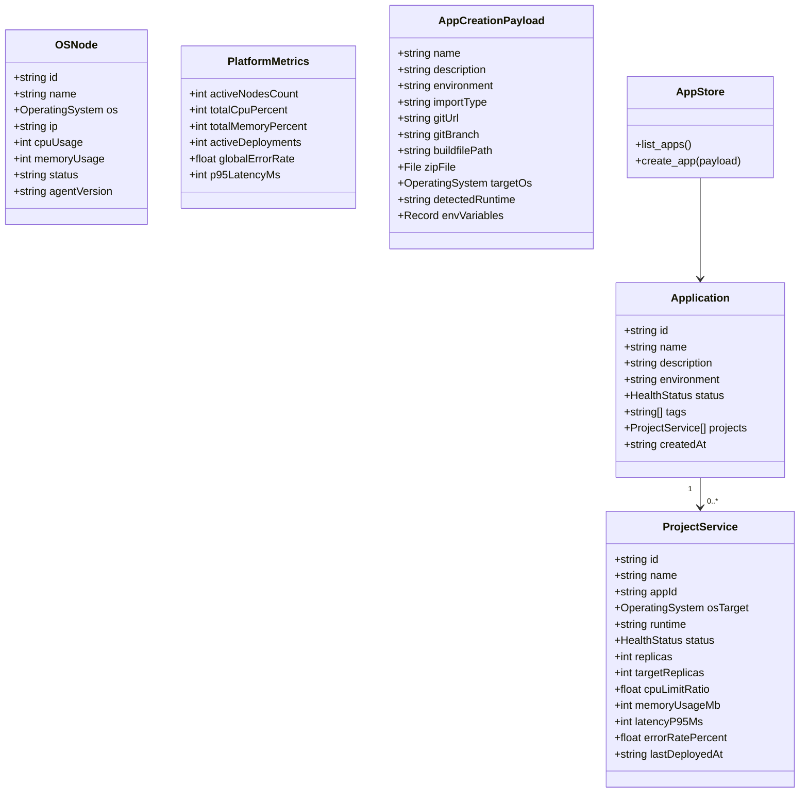

## 9. Deployment-mode aware flow

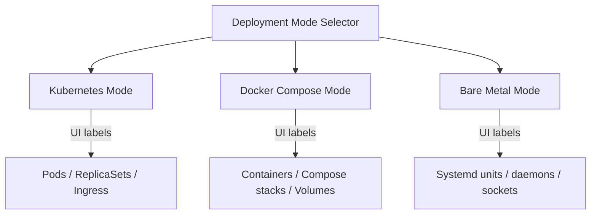

## 10. Request flow and state transitions

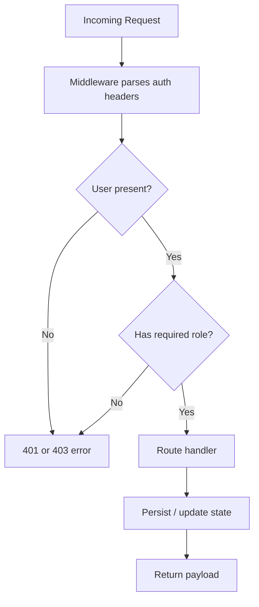

## 11. Edge cases and failure scenarios

### 11.1 Authentication and authorization
- Missing authentication headers should return 401 and block the request before state mutation.
- Unsupported persona or insufficient role should return 403 and keep the UI in a read-only mode.
- Auditor persona should be prevented from changing deployment mode, scaling replicas, or editing secrets.

### 11.2 Creation flows
- Invalid Git URL or missing branch should fail validation and show targeted errors.
- ZIP uploads that are empty, malformed, or too large should be rejected with a clear message.
- Runtime detection should fall back to a generic runtime label when auto-detection fails.

### 11.3 Runtime and deployment health
- Offline or degraded nodes should be displayed with the correct status and reduce confidence in deployment health.
- Scaling requests that exceed safe bounds should be capped or flagged for review.
- Failed deployments should preserve the last known healthy state and expose rollback guidance.

### 11.4 Persistence and data consistency
- If the database is unavailable, the system should return an explicit service error rather than silently succeeding.
- Partial or stale data from upstream metrics should not overwrite the last known healthy state without a reconciliation step.
- Application records should remain traceable with timestamps and ownership metadata.

## 12. Design notes for future implementation
- Separate API routes, domain services, and persistence concerns to avoid mixing UI state with business logic.
- Keep the orchestration payload shape stable so the frontend and backend evolve independently.
- Extend authorization checks in one place rather than scattering role conditions throughout route handlers.
- Treat deployment-mode terminology as a presentation concern to support Kubernetes, Docker Compose, and bare-metal modes from the same domain model.
