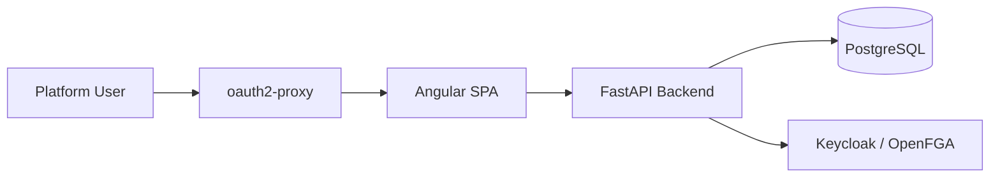

# Architecture

This section documents the platform architecture and the major components in the reference stack.

## Core components

- Frontend client application
- FastAPI backend service
- Keycloak for identity and role-based access
- OAuth2 Proxy for secure proxying
- OpenFGA for fine-grained authorization
- PostgreSQL for shared persistence

## Full architecture reference

The full detailed architecture guide, including system context, container diagrams, component maps, sequence diagrams, class diagrams, flow diagrams, and edge-case scenarios, lives in the repository architecture notes at [architecture/C4_architecture.md](https://github.com/rakrsh/application-orchestration-platform/blob/main/architecture/C4_architecture.md).

## Observability summary

The platform includes a lightweight OpenTelemetry pipeline for backend request tracing and frontend bootstrap instrumentation. The backend exports spans to an OTLP HTTP endpoint when `OTEL_EXPORTER_OTLP_ENDPOINT` is configured, and the frontend emits a dashboard initialization event that can be correlated with backend traces.

## Summary view

## Design principles

- Keep frontend state and backend state separate.
- Enforce persona-based access control for every mutation path.
- Make deployment-mode terminology and resource labels dynamic.
- Preserve auditability and failure visibility for create, scale, and deploy actions.
